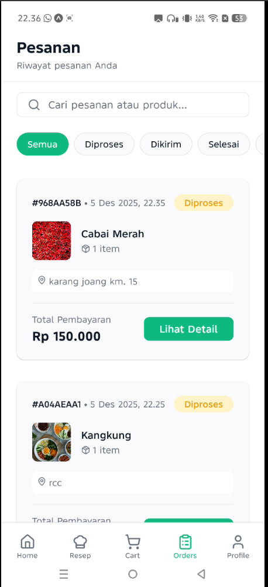
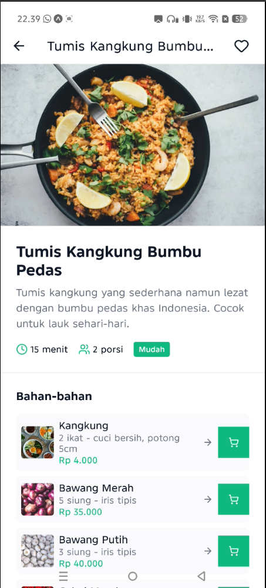
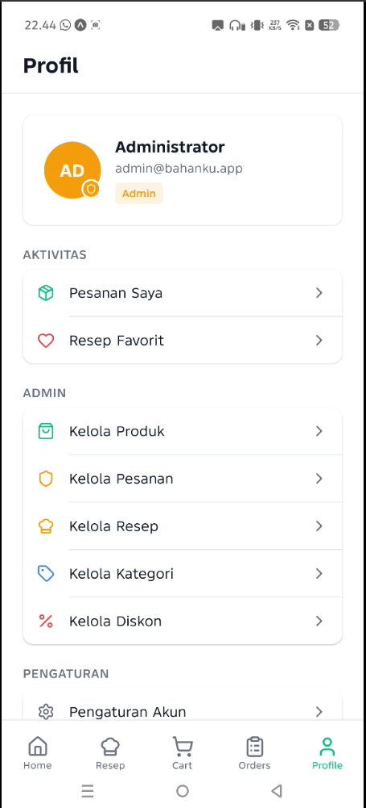
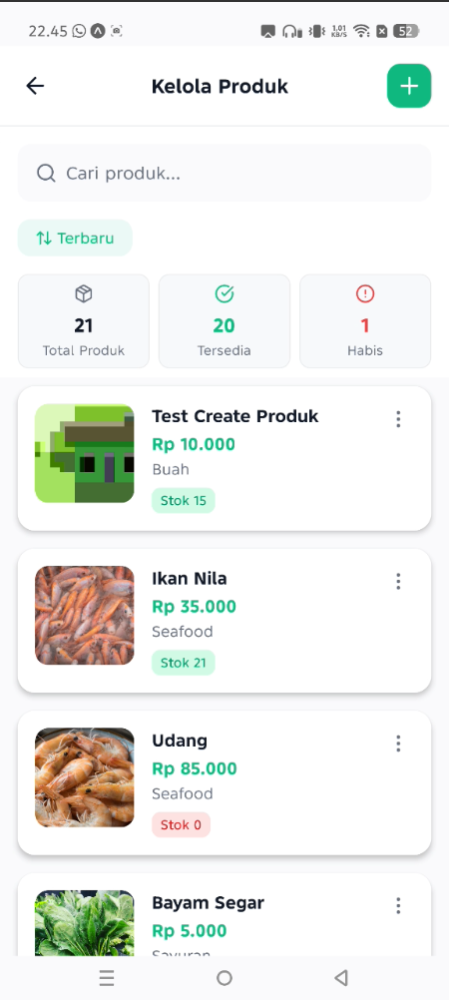
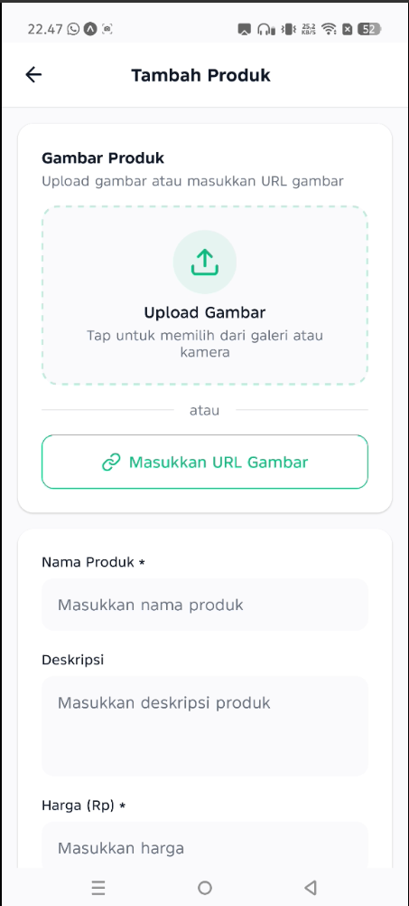
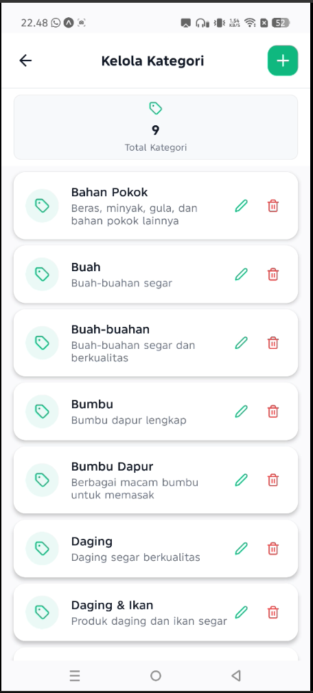
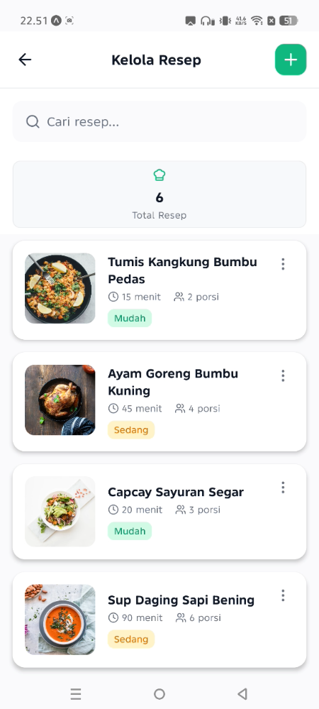

# BahanKu — E-Commerce Bahan Dapur Mobile App


**BahanKu** adalah aplikasi mobile e-commerce bahan dapur berbasis **React Native + Expo** dengan **TypeScript** dan **Supabase** sebagai backend. Aplikasi ini memungkinkan customer untuk membeli bahan dapur secara online, melihat inspirasi resep, dan mengelola pesanan. Admin dapat mengelola produk, kategori, diskon, dan status pesanan melalui panel admin yang terintegrasi.

---

## 📋 Daftar Isi

- [Fitur Utama](#-fitur-utama)
- [Tech Stack](#-tech-stack)
- [Persyaratan Sistem](#-persyaratan-sistem)
- [Instalasi](#-instalasi)
- [Konfigurasi](#-konfigurasi)
- [Role & Permissions](#-role--permissions)
- [Fitur Berdasarkan Role](#-fitur-berdasarkan-role)
- [Struktur Database](#-struktur-database)
- [Screenshot](#-screenshot)
- [Penggunaan](#-penggunaan)
- [Testing](#-testing)
- [Deployment](#-deployment)
- [Kontribusi](#-kontribusi)
- [Lisensi](#-lisensi)
- [Tim Pengembang](#-tim-pengembang)

---

## ✨ Fitur Utama

### Fitur Customer
- ✅ **Autentikasi Pengguna** — Register, login (email/password), dan Google Sign-In via Supabase Auth
- ✅ **Katalog Produk** — Browse produk dengan filter kategori, pencarian real-time, dan infinite scroll
- ✅ **Detail Produk** — Gambar produk, deskripsi lengkap, harga, stok, dan kategori
- ✅ **Keranjang Belanja** — Tambah/hapus produk, update quantity, persist ke AsyncStorage
- ✅ **Checkout & Order** — Modal checkout dengan input alamat pengiriman, validasi stok otomatis
- ✅ **Riwayat Pesanan** — Lihat semua pesanan dengan status timeline (Diproses → Dikirim → Selesai)
- ✅ **Resep Masakan** — Browse resep dengan bahan yang terhubung ke produk
- ✅ **Favorit Resep** — Simpan resep favorit untuk akses cepat
- ✅ **Profil Pengguna** — Kelola data pengguna dan logout

### Fitur Admin
- ✅ **Kelola Produk** — CRUD produk dengan upload gambar ke Supabase Storage
- ✅ **Kelola Kategori** — Tambah, edit, hapus kategori produk
- ✅ **Kelola Diskon** — Manajemen promo dan diskon aktif/tidak aktif
- ✅ **Kelola Pesanan** — Update status pesanan (diproses, dikirim, selesai, dibatalkan)
- ✅ **Kelola Resep** — CRUD resep masakan beserta bahan dan langkah
- ✅ **Dashboard Admin** — Statistik penjualan dan overview pesanan

### Fitur Tambahan
- ✅ **Offline-First Cart** — Cart tersimpan di AsyncStorage, tersedia tanpa internet
- ✅ **Search & Filter** — Pencarian produk dengan debounce 300ms, filter kategori
- ✅ **Empty State** — UI informatif saat data kosong
- ✅ **Loading Skeleton** — Skeleton loader untuk better UX
- ✅ **Toast Notifications** — Feedback real-time untuk aksi user
- ✅ **Responsive Design** — Optimized untuk Android, kompatibel dengan iOS

---

## 🛠 Tech Stack

### Frontend
- **Framework:** React Native 0.81.5
- **Navigation:** Expo Router 6.0 (file-based routing)
- **Language:** TypeScript 5.9 (strict mode)
- **State Management:** Zustand 5.0 + AsyncStorage persist middleware
- **Form Handling:** React Hook Form 7.65 + Zod 3.25 (validation)
- **Icons:** Lucide React Native 0.548
- **Image Picker:** Expo Image Picker 17.0
- **Build Tool:** Expo SDK 54

### Backend (Supabase)
- **Database:** PostgreSQL (relational database)
- **Authentication:** Supabase Auth (email/password + OAuth Google)
- **Storage:** Supabase Storage untuk gambar produk dan resep
- **Real-time:** Supabase Realtime untuk update status pesanan (opsional)
- **RPC Functions:** `fn_validate_stock`, `fn_create_order`
- **Database Views:** `v_order_details` untuk query optimization

### Libraries & Utilities
- **Async Storage:** `@react-native-async-storage/async-storage` 2.2.0
- **Supabase Client:** `@supabase/supabase-js` 2.76.1
- **URL Polyfill:** `react-native-url-polyfill` 3.0.0
- **Base64:** `base64-arraybuffer` 1.0.2 (untuk upload image)
- **Gesture Handler:** `react-native-gesture-handler` 2.28.0
- **Safe Area:** `react-native-safe-area-context` 5.6.2

### Tooling
- **TypeScript:** Strict mode enabled
- **ESLint:** React Native config + Prettier integration
- **Prettier:** Code formatting
- **Git:** Conventional commits (feat, fix, docs, etc.)

---

## 📦 Persyaratan Sistem

### Software Requirements
- **Node.js:** v18.x atau lebih baru (disarankan v20.x)
- **npm:** v9.x atau lebih baru (included dengan Node.js)
- **Expo CLI:** Tidak perlu install global, gunakan `npx expo`
- **Git:** Untuk clone repository

### Device Requirements
- **Android:** Expo Go app (download dari Google Play Store)
- **iOS:** Expo Go app (download dari App Store) — memerlukan macOS untuk build production
- **Physical Device:** Disarankan untuk testing kamera dan image picker

### Akun yang Dibutuhkan
- **Supabase Account:** Gratis di [supabase.com](https://supabase.com)
- **Expo Account:** (Opsional) untuk deployment EAS Build

---

## 🚀 Instalasi

### 1. Clone Repository

```powershell
# Clone repository dari GitHub
git clone https://github.com/aidilsaputrakirsan-classroom/final-project-mobile-programming-team-e-commerce.git

# Masuk ke folder project
cd final-project-mobile-programming-team-e-commerce
```

### 2. Navigasi ke Folder Aplikasi

```powershell
# PENTING: Semua command harus dijalankan dari folder BahankuApp
cd BahankuApp
```

### 3. Install Dependencies

```powershell
# Install semua dependencies
npm install
```

**Catatan:** Jika ada warning peer dependencies, itu normal dan tidak masalah.

### 4. Verifikasi Instalasi

```powershell
# Cek apakah semua dependencies terinstall dengan benar
npm ls --depth=0

# Cek TypeScript tidak ada error
npx tsc --noEmit
```

---

## ⚙️ Konfigurasi

### 1. Environment Variables

Buat file `.env` di folder `BahankuApp/` dengan isi sebagai berikut:

```env
# Supabase Configuration
EXPO_PUBLIC_SUPABASE_URL=https://your-project.supabase.co
EXPO_PUBLIC_SUPABASE_ANON_KEY=your-anon-key-here
```

**Cara mendapatkan credentials:**
1. Login ke [Supabase Dashboard](https://app.supabase.com)
2. Pilih project atau buat project baru
3. Buka **Settings** → **API**
4. Copy **Project URL** dan **anon public key**

### 2. Setup Database

#### Opsi A: Menggunakan Supabase Studio (Recommended)

1. Buka Supabase Dashboard → **SQL Editor**
2. Jalankan script berikut secara berurutan:

**a. Enable UUID Extension**
```sql
CREATE EXTENSION IF NOT EXISTS "uuid-ossp";
```

**b. Create Tables**
```sql
-- Users table (extends Supabase auth.users)
CREATE TABLE users (
  id UUID PRIMARY KEY REFERENCES auth.users(id) ON DELETE CASCADE,
  full_name TEXT,
  email TEXT UNIQUE NOT NULL,
  role TEXT DEFAULT 'customer' CHECK (role IN ('customer', 'admin')),
  created_at TIMESTAMPTZ DEFAULT NOW(),
  updated_at TIMESTAMPTZ DEFAULT NOW()
);

-- Categories table
CREATE TABLE categories (
  id UUID PRIMARY KEY DEFAULT uuid_generate_v4(),
  name TEXT UNIQUE NOT NULL,
  description TEXT,
  created_at TIMESTAMPTZ DEFAULT NOW(),
  updated_at TIMESTAMPTZ DEFAULT NOW()
);

-- Products table
CREATE TABLE products (
  id UUID PRIMARY KEY DEFAULT uuid_generate_v4(),
  name TEXT NOT NULL,
  description TEXT,
  price NUMERIC(10,2) NOT NULL CHECK (price >= 0),
  stock INTEGER NOT NULL DEFAULT 0 CHECK (stock >= 0),
  category_id UUID REFERENCES categories(id) ON DELETE SET NULL,
  image_url TEXT,
  is_active BOOLEAN DEFAULT TRUE,
  created_at TIMESTAMPTZ DEFAULT NOW(),
  updated_at TIMESTAMPTZ DEFAULT NOW()
);

-- Orders table
CREATE TABLE orders (
  id UUID PRIMARY KEY DEFAULT uuid_generate_v4(),
  user_id UUID NOT NULL REFERENCES users(id) ON DELETE CASCADE,
  total_price NUMERIC(10,2) NOT NULL CHECK (total_price >= 0),
  status TEXT DEFAULT 'diproses' CHECK (status IN ('diproses', 'dikirim', 'selesai', 'dibatalkan')),
  shipping_address TEXT NOT NULL,
  created_at TIMESTAMPTZ DEFAULT NOW(),
  updated_at TIMESTAMPTZ DEFAULT NOW()
);

-- Order Items table
CREATE TABLE order_items (
  id UUID PRIMARY KEY DEFAULT uuid_generate_v4(),
  order_id UUID NOT NULL REFERENCES orders(id) ON DELETE CASCADE,
  product_id UUID NOT NULL REFERENCES products(id) ON DELETE RESTRICT,
  quantity INTEGER NOT NULL CHECK (quantity > 0),
  subtotal NUMERIC(10,2) NOT NULL CHECK (subtotal >= 0),
  created_at TIMESTAMPTZ DEFAULT NOW()
);

-- Recipes table
CREATE TABLE recipes (
  id UUID PRIMARY KEY DEFAULT uuid_generate_v4(),
  title TEXT NOT NULL,
  description TEXT,
  image_url TEXT,
  cook_time INTEGER, -- in minutes
  servings INTEGER,
  difficulty TEXT CHECK (difficulty IN ('mudah', 'sedang', 'sulit')),
  instructions TEXT,
  created_at TIMESTAMPTZ DEFAULT NOW(),
  updated_at TIMESTAMPTZ DEFAULT NOW()
);

-- Recipe Products (ingredients)
CREATE TABLE recipe_products (
  id UUID PRIMARY KEY DEFAULT uuid_generate_v4(),
  recipe_id UUID NOT NULL REFERENCES recipes(id) ON DELETE CASCADE,
  product_id UUID REFERENCES products(id) ON DELETE SET NULL,
  ingredient_name TEXT NOT NULL,
  quantity TEXT NOT NULL, -- e.g., "200 gram", "2 buah"
  created_at TIMESTAMPTZ DEFAULT NOW()
);

-- Favorite Recipes
CREATE TABLE favorite_recipes (
  id UUID PRIMARY KEY DEFAULT uuid_generate_v4(),
  user_id UUID NOT NULL REFERENCES users(id) ON DELETE CASCADE,
  recipe_id UUID NOT NULL REFERENCES recipes(id) ON DELETE CASCADE,
  created_at TIMESTAMPTZ DEFAULT NOW(),
  UNIQUE(user_id, recipe_id)
);

-- Discounts table
CREATE TABLE discounts (
  id UUID PRIMARY KEY DEFAULT uuid_generate_v4(),
  name TEXT NOT NULL,
  description TEXT,
  discount_percent NUMERIC(5,2) CHECK (discount_percent >= 0 AND discount_percent <= 100),
  start_date TIMESTAMPTZ NOT NULL,
  end_date TIMESTAMPTZ NOT NULL,
  is_active BOOLEAN DEFAULT TRUE,
  created_at TIMESTAMPTZ DEFAULT NOW(),
  updated_at TIMESTAMPTZ DEFAULT NOW()
);
```

**c. Create Indexes**
```sql
CREATE INDEX idx_products_category ON products(category_id);
CREATE INDEX idx_products_active ON products(is_active);
CREATE INDEX idx_orders_user ON orders(user_id);
CREATE INDEX idx_orders_status ON orders(status);
CREATE INDEX idx_orders_created ON orders(created_at DESC);
CREATE INDEX idx_order_items_order ON order_items(order_id);
CREATE INDEX idx_order_items_product ON order_items(product_id);
CREATE INDEX idx_recipe_products_recipe ON recipe_products(recipe_id);
CREATE INDEX idx_favorite_recipes_user ON favorite_recipes(user_id);
```

**d. Create RPC Functions**
```sql
-- Function to validate stock before checkout
CREATE OR REPLACE FUNCTION fn_validate_stock(cart_items JSONB)
RETURNS TABLE(product_id UUID, available_stock INTEGER, requested_qty INTEGER, is_sufficient BOOLEAN)
LANGUAGE plpgsql
AS $$
BEGIN
  RETURN QUERY
  SELECT 
    (item->>'product_id')::UUID AS product_id,
    p.stock AS available_stock,
    (item->>'quantity')::INTEGER AS requested_qty,
    p.stock >= (item->>'quantity')::INTEGER AS is_sufficient
  FROM jsonb_array_elements(cart_items) AS item
  JOIN products p ON p.id = (item->>'product_id')::UUID;
END;
$$;

-- Function to create order with transaction
CREATE OR REPLACE FUNCTION fn_create_order(
  p_user_id UUID,
  p_cart_items JSONB,
  p_shipping_address TEXT
)
RETURNS UUID
LANGUAGE plpgsql
AS $$
DECLARE
  v_order_id UUID;
  v_total_price NUMERIC := 0;
  v_item RECORD;
BEGIN
  -- Calculate total price
  FOR v_item IN SELECT * FROM jsonb_array_elements(p_cart_items)
  LOOP
    SELECT price * (v_item.value->>'quantity')::INTEGER INTO v_total_price
    FROM products WHERE id = (v_item.value->>'product_id')::UUID;
  END LOOP;

  -- Create order
  INSERT INTO orders (user_id, total_price, shipping_address)
  VALUES (p_user_id, v_total_price, p_shipping_address)
  RETURNING id INTO v_order_id;

  -- Insert order items and update stock
  FOR v_item IN SELECT * FROM jsonb_array_elements(p_cart_items)
  LOOP
    INSERT INTO order_items (order_id, product_id, quantity, subtotal)
    SELECT 
      v_order_id,
      (v_item.value->>'product_id')::UUID,
      (v_item.value->>'quantity')::INTEGER,
      price * (v_item.value->>'quantity')::INTEGER
    FROM products WHERE id = (v_item.value->>'product_id')::UUID;

    -- Update stock
    UPDATE products
    SET stock = stock - (v_item.value->>'quantity')::INTEGER
    WHERE id = (v_item.value->>'product_id')::UUID;
  END LOOP;

  RETURN v_order_id;
END;
$$;
```

**e. Create View**
```sql
CREATE OR REPLACE VIEW v_order_details AS
SELECT 
  o.id AS order_id,
  o.user_id,
  u.full_name AS customer_name,
  u.email AS customer_email,
  o.total_price,
  o.status,
  o.shipping_address,
  o.created_at,
  o.updated_at,
  jsonb_agg(
    jsonb_build_object(
      'product_id', oi.product_id,
      'product_name', p.name,
      'quantity', oi.quantity,
      'subtotal', oi.subtotal,
      'image_url', p.image_url
    )
  ) AS items
FROM orders o
JOIN users u ON o.user_id = u.id
LEFT JOIN order_items oi ON o.id = oi.order_id
LEFT JOIN products p ON oi.product_id = p.id
GROUP BY o.id, u.full_name, u.email;
```

**f. Setup Row Level Security (RLS)**
```sql
-- Enable RLS on all tables
ALTER TABLE users ENABLE ROW LEVEL SECURITY;
ALTER TABLE products ENABLE ROW LEVEL SECURITY;
ALTER TABLE categories ENABLE ROW LEVEL SECURITY;
ALTER TABLE orders ENABLE ROW LEVEL SECURITY;
ALTER TABLE order_items ENABLE ROW LEVEL SECURITY;
ALTER TABLE recipes ENABLE ROW LEVEL SECURITY;
ALTER TABLE recipe_products ENABLE ROW LEVEL SECURITY;
ALTER TABLE favorite_recipes ENABLE ROW LEVEL SECURITY;
ALTER TABLE discounts ENABLE ROW LEVEL SECURITY;

-- Users policies
CREATE POLICY "Users can read own data" ON users FOR SELECT USING (auth.uid() = id);
CREATE POLICY "Users can update own data" ON users FOR UPDATE USING (auth.uid() = id);

-- Products policies
CREATE POLICY "Products are viewable by everyone" ON products FOR SELECT USING (is_active = TRUE OR EXISTS (SELECT 1 FROM users WHERE id = auth.uid() AND role = 'admin'));
CREATE POLICY "Only admins can insert products" ON products FOR INSERT WITH CHECK (EXISTS (SELECT 1 FROM users WHERE id = auth.uid() AND role = 'admin'));
CREATE POLICY "Only admins can update products" ON products FOR UPDATE USING (EXISTS (SELECT 1 FROM users WHERE id = auth.uid() AND role = 'admin'));
CREATE POLICY "Only admins can delete products" ON products FOR DELETE USING (EXISTS (SELECT 1 FROM users WHERE id = auth.uid() AND role = 'admin'));

-- Categories policies
CREATE POLICY "Categories are viewable by everyone" ON categories FOR SELECT USING (TRUE);
CREATE POLICY "Only admins can manage categories" ON categories FOR ALL USING (EXISTS (SELECT 1 FROM users WHERE id = auth.uid() AND role = 'admin'));

-- Orders policies
CREATE POLICY "Users can view own orders" ON orders FOR SELECT USING (auth.uid() = user_id OR EXISTS (SELECT 1 FROM users WHERE id = auth.uid() AND role = 'admin'));
CREATE POLICY "Users can create own orders" ON orders FOR INSERT WITH CHECK (auth.uid() = user_id);
CREATE POLICY "Only admins can update orders" ON orders FOR UPDATE USING (EXISTS (SELECT 1 FROM users WHERE id = auth.uid() AND role = 'admin'));

-- Order items policies
CREATE POLICY "Users can view own order items" ON order_items FOR SELECT USING (EXISTS (SELECT 1 FROM orders WHERE id = order_id AND user_id = auth.uid()) OR EXISTS (SELECT 1 FROM users WHERE id = auth.uid() AND role = 'admin'));
CREATE POLICY "Users can insert own order items" ON order_items FOR INSERT WITH CHECK (EXISTS (SELECT 1 FROM orders WHERE id = order_id AND user_id = auth.uid()));

-- Recipes policies
CREATE POLICY "Recipes are viewable by everyone" ON recipes FOR SELECT USING (TRUE);
CREATE POLICY "Only admins can manage recipes" ON recipes FOR ALL USING (EXISTS (SELECT 1 FROM users WHERE id = auth.uid() AND role = 'admin'));

-- Recipe products policies
CREATE POLICY "Recipe products are viewable by everyone" ON recipe_products FOR SELECT USING (TRUE);
CREATE POLICY "Only admins can manage recipe products" ON recipe_products FOR ALL USING (EXISTS (SELECT 1 FROM users WHERE id = auth.uid() AND role = 'admin'));

-- Favorite recipes policies
CREATE POLICY "Users can view own favorites" ON favorite_recipes FOR SELECT USING (auth.uid() = user_id);
CREATE POLICY "Users can manage own favorites" ON favorite_recipes FOR ALL USING (auth.uid() = user_id);

-- Discounts policies
CREATE POLICY "Discounts are viewable by everyone" ON discounts FOR SELECT USING (is_active = TRUE OR EXISTS (SELECT 1 FROM users WHERE id = auth.uid() AND role = 'admin'));
CREATE POLICY "Only admins can manage discounts" ON discounts FOR ALL USING (EXISTS (SELECT 1 FROM users WHERE id = auth.uid() AND role = 'admin'));
```

### 3. Setup Storage Bucket

1. Buka Supabase Dashboard → **Storage**
2. Klik **New Bucket**
3. Nama bucket: `products`
4. Public bucket: **Yes** (agar gambar bisa diakses publik)
5. Klik **Create Bucket**

**Setup Storage Policies:**
```sql
-- Allow public to read files
CREATE POLICY "Public can read product images" ON storage.objects FOR SELECT USING (bucket_id = 'products');

-- Allow authenticated users to upload
CREATE POLICY "Authenticated users can upload" ON storage.objects FOR INSERT WITH CHECK (bucket_id = 'products' AND auth.role() = 'authenticated');

-- Allow admin to delete
CREATE POLICY "Admins can delete images" ON storage.objects FOR DELETE USING (bucket_id = 'products' AND EXISTS (SELECT 1 FROM users WHERE id = auth.uid() AND role = 'admin'));
```

### 4. Seed Data (Opsional)

Untuk testing, jalankan script insert sample data:

```sql
-- Insert sample categories
INSERT INTO categories (name, description) VALUES
  ('Sayuran', 'Sayuran segar pilihan'),
  ('Buah', 'Buah-buahan segar'),
  ('Daging', 'Daging dan unggas berkualitas'),
  ('Ikan & Seafood', 'Ikan dan seafood segar'),
  ('Bumbu Dapur', 'Bumbu dan rempah-rempah'),
  ('Sembako', 'Beras, minyak, gula, dll'),
  ('Frozen Food', 'Makanan beku siap masak'),
  ('Minuman', 'Minuman segar dan kemasan'),
  ('Snack', 'Camilan dan makanan ringan');

-- Insert sample products (20 products)
-- Note: Gunakan category_id yang sesuai dari hasil insert categories
-- Contoh beberapa produk:
INSERT INTO products (name, description, price, stock, category_id, image_url) VALUES
  ('Bayam Segar', 'Bayam hijau segar per ikat (250g)', 5000, 50, (SELECT id FROM categories WHERE name = 'Sayuran'), NULL),
  ('Kangkung', 'Kangkung segar per ikat (200g)', 4000, 60, (SELECT id FROM categories WHERE name = 'Sayuran'), NULL),
  ('Bawang Merah', 'Bawang merah ukuran sedang per kg', 35000, 100, (SELECT id FROM categories WHERE name = 'Bumbu Dapur'), NULL),
  ('Bawang Putih', 'Bawang putih kualitas premium per kg', 45000, 80, (SELECT id FROM categories WHERE name = 'Bumbu Dapur'), NULL),
  ('Cabai Merah', 'Cabai merah keriting segar per kg', 50000, 40, (SELECT id FROM categories WHERE name = 'Bumbu Dapur'), NULL),
  ('Tomat', 'Tomat merah segar per kg', 12000, 70, (SELECT id FROM categories WHERE name = 'Sayuran'), NULL),
  ('Daging Ayam Fillet', 'Fillet ayam tanpa tulang per kg', 45000, 30, (SELECT id FROM categories WHERE name = 'Daging'), NULL),
  ('Daging Sapi', 'Daging sapi segar has dalam per kg', 120000, 20, (SELECT id FROM categories WHERE name = 'Daging'), NULL),
  ('Ikan Nila', 'Ikan nila segar ukuran sedang per kg', 35000, 25, (SELECT id FROM categories WHERE name = 'Ikan & Seafood'), NULL),
  ('Udang', 'Udang segar ukuran besar per kg', 85000, 15, (SELECT id FROM categories WHERE name = 'Ikan & Seafood'), NULL);
```

### 5. Create Admin Account

**Via Supabase Dashboard:**
1. Buka **Authentication** → **Users**
2. Klik **Add User**
3. Email: `admin@bahanku.app`
4. Password: `Admin123@`
5. Auto Confirm User: **Yes**
6. Klik **Create User**

**Update Role ke Admin:**
Jalankan SQL berikut di SQL Editor:
```sql
-- Insert admin ke tabel users
INSERT INTO users (id, full_name, email, role)
VALUES (
  (SELECT id FROM auth.users WHERE email = 'admin@bahanku.app'),
  'Administrator',
  'admin@bahanku.app',
  'admin'
)
ON CONFLICT (id) DO UPDATE SET role = 'admin';
```

**Kredensial Default:**
- **Admin:** `admin@bahanku.app` / `Admin123@`
- **Sample Customer:** Register via aplikasi atau buat manual

⚠️ **PENTING:** Ganti password admin setelah deployment produksi!

---

## 👥 Role & Permissions

BahanKu menggunakan 2 role utama:

### 1. Customer (Default)
- Akses: Browse produk, cart, checkout, riwayat pesanan, resep, favorit
- Tidak bisa: Akses halaman admin, edit produk, update status pesanan

### 2. Admin
- Akses: Semua fitur customer + panel admin
- Dapat: CRUD produk, kategori, diskon, resep, update status pesanan, lihat semua pesanan

**Role Assignment:**
- Default role saat register: `customer`
- Admin harus dibuat manual via Supabase Dashboard
- Role tersimpan di kolom `users.role`

---

## 🔐 Fitur Berdasarkan Role

| Fitur | Customer | Admin |
|-------|----------|-------|
| **Autentikasi** |
| Register & Login | ✅ | ✅ |
| Google Sign-In | ✅ | ✅ |
| Logout | ✅ | ✅ |
| **Produk** |
| Browse Katalog Produk | ✅ | ✅ |
| Lihat Detail Produk | ✅ | ✅ |
| Search & Filter Produk | ✅ | ✅ |
| Tambah Produk Baru | ❌ | ✅ |
| Edit Produk | ❌ | ✅ |
| Hapus Produk | ❌ | ✅ |
| Upload Gambar Produk | ❌ | ✅ |
| **Keranjang & Pesanan** |
| Tambah ke Keranjang | ✅ | ✅ |
| Update Quantity di Cart | ✅ | ✅ |
| Hapus dari Cart | ✅ | ✅ |
| Checkout | ✅ | ✅ |
| Lihat Riwayat Pesanan Sendiri | ✅ | ✅ |
| Lihat Semua Pesanan (All Users) | ❌ | ✅ |
| Update Status Pesanan | ❌ | ✅ |
| **Resep** |
| Browse Resep | ✅ | ✅ |
| Lihat Detail Resep | ✅ | ✅ |
| Tambah Resep Baru | ❌ | ✅ |
| Edit Resep | ❌ | ✅ |
| Hapus Resep | ❌ | ✅ |
| Tambah/Hapus Favorit | ✅ | ✅ |
| **Kategori** |
| Lihat Kategori | ✅ | ✅ |
| CRUD Kategori | ❌ | ✅ |
| **Diskon** |
| Lihat Diskon Aktif | ✅ | ✅ |
| CRUD Diskon | ❌ | ✅ |
| **Profil** |
| Lihat Profil Sendiri | ✅ | ✅ |
| Update Profil | ✅ | ✅ |
| Akses Menu Admin | ❌ | ✅ |

---

## 🗄 Struktur Database

### Entity Relationship Diagram


### Tabel Utama

#### 1. **users**
Extends `auth.users` dari Supabase Auth.
```sql
id UUID PRIMARY KEY (FK to auth.users)
full_name TEXT
email TEXT UNIQUE
role TEXT ('customer' | 'admin')
created_at TIMESTAMPTZ
updated_at TIMESTAMPTZ
```

#### 2. **categories**
Klasifikasi produk.
```sql
id UUID PRIMARY KEY
name TEXT UNIQUE
description TEXT
created_at TIMESTAMPTZ
updated_at TIMESTAMPTZ
```

#### 3. **products**
Katalog produk bahan dapur.
```sql
id UUID PRIMARY KEY
name TEXT
description TEXT
price NUMERIC(10,2)
stock INTEGER
category_id UUID (FK to categories)
image_url TEXT
is_active BOOLEAN
created_at TIMESTAMPTZ
updated_at TIMESTAMPTZ
```

#### 4. **orders**
Transaksi pembelian.
```sql
id UUID PRIMARY KEY
user_id UUID (FK to users)
total_price NUMERIC(10,2)
status TEXT ('diproses' | 'dikirim' | 'selesai' | 'dibatalkan')
shipping_address TEXT
created_at TIMESTAMPTZ
updated_at TIMESTAMPTZ
```

#### 5. **order_items**
Detail produk dalam pesanan.
```sql
id UUID PRIMARY KEY
order_id UUID (FK to orders)
product_id UUID (FK to products)
quantity INTEGER
subtotal NUMERIC(10,2)
created_at TIMESTAMPTZ
```

#### 6. **recipes**
Resep masakan.
```sql
id UUID PRIMARY KEY
title TEXT
description TEXT
image_url TEXT
cook_time INTEGER
servings INTEGER
difficulty TEXT ('mudah' | 'sedang' | 'sulit')
instructions TEXT
created_at TIMESTAMPTZ
updated_at TIMESTAMPTZ
```

#### 7. **recipe_products**
Bahan-bahan resep.
```sql
id UUID PRIMARY KEY
recipe_id UUID (FK to recipes)
product_id UUID (FK to products, nullable)
ingredient_name TEXT
quantity TEXT
created_at TIMESTAMPTZ
```

#### 8. **favorite_recipes**
Resep favorit user.
```sql
id UUID PRIMARY KEY
user_id UUID (FK to users)
recipe_id UUID (FK to recipes)
created_at TIMESTAMPTZ
UNIQUE(user_id, recipe_id)
```

#### 9. **discounts**
Manajemen diskon.
```sql
id UUID PRIMARY KEY
name TEXT
description TEXT
discount_percent NUMERIC(5,2)
start_date TIMESTAMPTZ
end_date TIMESTAMPTZ
is_active BOOLEAN
created_at TIMESTAMPTZ
updated_at TIMESTAMPTZ
```

### Database Functions

#### `fn_validate_stock(cart_items JSONB)`
Validasi stok produk sebelum checkout.

**Input:**
```json
[
  {"product_id": "uuid-here", "quantity": 2},
  {"product_id": "uuid-here", "quantity": 3}
]
```

**Output:**
```sql
TABLE(product_id UUID, available_stock INT, requested_qty INT, is_sufficient BOOL)
```

#### `fn_create_order(p_user_id UUID, p_cart_items JSONB, p_shipping_address TEXT)`
Buat order baru dengan transaksi atomic (insert order, order_items, update stock).

**Returns:** `UUID` (order_id)

### Database Views

#### `v_order_details`
View untuk query order beserta items (optimized untuk UI).
```sql
SELECT 
  order_id, user_id, customer_name, customer_email,
  total_price, status, shipping_address,
  created_at, updated_at,
  items (JSONB array)
FROM v_order_details
WHERE user_id = 'current-user-id';
```

---

## 📸 Screenshot

### Customer Flow

#### 1. Authentication
<div style="display: flex; gap: 10px;">
  
  
</div>

**Login Screen** — Email/password login dengan opsi Google Sign-In  
**Register Screen** — Form registrasi dengan validasi real-time

#### 2. Home & Product Catalog
<div style="display: flex; gap: 10px;">
  
  
</div>

**Home Screen** — Promo banner, kategori filter, dan product grid  
**Product Detail** — Gambar produk, deskripsi, harga, stok, dan quantity stepper

#### 3. Cart & Checkout
<div style="display: flex; gap: 10px;">
  
  
</div>

**Cart Screen** — Daftar item dengan checkbox select all, update qty, hapus  
**Checkout Modal** — Input alamat pengiriman dan konfirmasi pesanan

#### 4. Orders
<div style="display: flex; gap: 10px;">
  
  
</div>

**Orders List** — Riwayat pesanan dengan filter status dan search  
**Order Detail** — Timeline status, daftar item, total harga, dan action buttons

#### 5. Recipes & Favorites
<div style="display: flex; gap: 10px;">
  
  
  
</div>

**Recipes List** — Grid resep dengan tombol favorit  
**Recipe Detail** — Bahan, langkah memasak, dan link ke produk  
**Favorites List** — Resep yang disimpan user

#### 6. Profile
<div style="display: flex; gap: 10px;">
  
</div>

**Profile Screen** — Data user, menu admin (jika role admin), dan logout

### Admin Flow

#### 7. Admin Products
<div style="display: flex; gap: 10px;">
  
  
</div>

**Admin Products** — List produk dengan search, filter, dan action menu  
**Product Form** — Form tambah/edit produk dengan upload image

#### 8. Admin Orders & Management
<div style="display: flex; gap: 10px;">
  
  
  
  
</div>

**Admin Orders** — Kelola semua pesanan dengan filter dan update status  
**Admin Categories** — CRUD kategori produk  
**Admin Discounts** — Manajemen diskon aktif/tidak aktif  
**Admin Recipes** — CRUD resep masakan

---

## 🎮 Penggunaan

### 1. Jalankan Aplikasi

```powershell
# Pastikan berada di folder BahankuApp
cd BahankuApp

# Bersihkan cache dan jalankan Expo
npx expo start -c
```

### 2. Scan QR Code

- **Android:** Buka **Expo Go** → Scan QR Code
- **iOS:** Buka **Camera** → Scan QR Code → Open in Expo Go

### 3. Login

**Sebagai Admin:**
- Email: `admin@bahanku.app`
- Password: `Admin123@`

**Sebagai Customer:**
- Register akun baru via aplikasi
- Atau buat akun manual di Supabase Dashboard

### 4. Testing Flow

**Customer Flow:**
1. Login → Browse produk
2. Klik produk → Lihat detail → Tambah ke cart
3. Buka cart → Update qty → Checkout
4. Input alamat → Konfirmasi pesanan
5. Lihat riwayat di tab Orders
6. Explore resep → Tambah favorit

**Admin Flow:**
1. Login sebagai admin
2. Buka profile → Menu "Kelola Produk"
3. Tambah produk baru dengan upload gambar
4. Update status pesanan di Admin Orders
5. Kelola kategori, diskon, dan resep

---

## 🧪 Testing

### Manual Testing

```powershell
# Lint check
npm run lint

# TypeScript type check
npx tsc --noEmit

# Format check
npm run format
```

### Testing Checklist

- [ ] **Authentication:**
  - [ ] Register dengan email valid
  - [ ] Login dengan credentials benar
  - [ ] Login dengan Google (optional)
  - [ ] Logout dan session cleared
  - [ ] Session persist setelah restart app

- [ ] **Products:**
  - [ ] List produk tampil di home
  - [ ] Search produk bekerja dengan debounce
  - [ ] Filter kategori bekerja
  - [ ] Detail produk tampil lengkap
  - [ ] Tambah ke cart berhasil

- [ ] **Cart:**
  - [ ] Item muncul di cart setelah ditambah
  - [ ] Update quantity bekerja (min 1, max stok)
  - [ ] Hapus item dari cart bekerja
  - [ ] Total harga kalkulasi benar
  - [ ] Cart persist setelah restart app

- [ ] **Checkout:**
  - [ ] Modal checkout muncul
  - [ ] Validasi alamat (min 10 karakter)
  - [ ] Checkout berhasil buat order
  - [ ] Stok produk update setelah checkout
  - [ ] Cart cleared setelah checkout
  - [ ] Error handling jika stok tidak cukup

- [ ] **Orders:**
  - [ ] Riwayat pesanan tampil
  - [ ] Filter status bekerja
  - [ ] Search order bekerja
  - [ ] Detail order tampil lengkap
  - [ ] Timeline status update (admin)

- [ ] **Recipes:**
  - [ ] List resep tampil
  - [ ] Detail resep tampil dengan bahan
  - [ ] Tambah/hapus favorit bekerja
  - [ ] Link ke produk dari bahan bekerja

- [ ] **Admin:**
  - [ ] Menu admin hanya tampil untuk admin role
  - [ ] CRUD produk bekerja
  - [ ] Upload image ke Supabase Storage
  - [ ] CRUD kategori bekerja
  - [ ] Update status pesanan bekerja
  - [ ] CRUD diskon bekerja
  - [ ] CRUD resep bekerja

### Known Issues

- **iOS Session Persistence:** Jika session tidak persist di iOS, hapus Expo Go cache dan reinstall app. Lihat `docs/chatgpt_web_response_iphone auth issue.md`.
- **Image Upload di Android:** Pastikan permission storage sudah granted.
- **Metro Bundle Cache:** Jika ada error "Invariant Violation", clear cache dengan `npx expo start -c`.

---

## 🚀 Deployment

### Deployment ke Expo Go (Development)

Aplikasi sudah bisa diakses via Expo Go setelah `npx expo start`.

### Deployment ke EAS Build (Production)

#### 1. Install EAS CLI

```powershell
npm install -g eas-cli
```

#### 2. Login ke Expo Account

```powershell
eas login
```

#### 3. Configure EAS

```powershell
eas build:configure
```

#### 4. Build for Android

```powershell
# Build APK untuk testing
eas build --platform android --profile preview

# Build AAB untuk Google Play Store
eas build --platform android --profile production
```

#### 5. Build for iOS (Requires macOS)

```powershell
# Build untuk TestFlight
eas build --platform ios --profile production
```

#### 6. Submit ke Store

```powershell
# Android
eas submit --platform android

# iOS
eas submit --platform ios
```

**Dokumentasi Lengkap:** [Expo EAS Build](https://docs.expo.dev/build/introduction/)

### Environment Variables untuk Production

Buat file `eas.json` di root `BahankuApp/`:
```json
{
  "build": {
    "production": {
      "env": {
        "EXPO_PUBLIC_SUPABASE_URL": "your-production-url",
        "EXPO_PUBLIC_SUPABASE_ANON_KEY": "your-production-key"
      }
    }
  }
}
```

---

## 🤝 Kontribusi

Kami menerima kontribusi dari siapa saja! Berikut panduan kontribusi:

### 1. Fork Repository

Klik tombol **Fork** di GitHub.

### 2. Clone Fork Anda

```powershell
git clone https://github.com/your-username/final-project-mobile-programming-team-e-commerce.git
cd final-project-mobile-programming-team-e-commerce/BahankuApp
```

### 3. Buat Branch Baru

```powershell
git checkout -b feature/nama-fitur-anda
```

### 4. Commit Changes

```powershell
git add .
git commit -m "feat: tambah fitur xyz"
```

**Commit Message Convention:**
- `feat:` — Fitur baru
- `fix:` — Bug fix
- `docs:` — Update dokumentasi
- `style:` — Format code (tidak mengubah logic)
- `refactor:` — Refactor code
- `test:` — Tambah test
- `chore:` — Update dependencies, build config, etc.

### 5. Push ke Fork

```powershell
git push origin feature/nama-fitur-anda
```

### 6. Buat Pull Request

Buka GitHub → Klik **New Pull Request** → Pilih branch Anda.

**Pull Request Template:**
```markdown
## Deskripsi
[Jelaskan perubahan yang dibuat]

## Tipe Perubahan
- [ ] Bug fix
- [ ] Fitur baru
- [ ] Breaking change
- [ ] Dokumentasi

## Testing
- [ ] Sudah di-test di Android
- [ ] Sudah di-test di iOS
- [ ] Sudah lint check
- [ ] TypeScript type check passed

## Screenshot (jika ada perubahan UI)
[Tambahkan screenshot]
```

---

## 📄 Lisensi

Proyek ini dilisensikan di bawah **MIT License**.

```
MIT License

Copyright (c) 2025 BahanKu Team

Permission is hereby granted, free of charge, to any person obtaining a copy
of this software and associated documentation files (the "Software"), to deal
in the Software without restriction, including without limitation the rights
to use, copy, modify, merge, publish, distribute, sublicense, and/or sell
copies of the Software, and to permit persons to whom the Software is
furnished to do so, subject to the following conditions:

The above copyright notice and this permission notice shall be included in all
copies or substantial portions of the Software.

THE SOFTWARE IS PROVIDED "AS IS", WITHOUT WARRANTY OF ANY KIND, EXPRESS OR
IMPLIED, INCLUDING BUT NOT LIMITED TO THE WARRANTIES OF MERCHANTABILITY,
FITNESS FOR A PARTICULAR PURPOSE AND NONINFRINGEMENT. IN NO EVENT SHALL THE
AUTHORS OR COPYRIGHT HOLDERS BE LIABLE FOR ANY CLAIM, DAMAGES OR OTHER
LIABILITY, WHETHER IN AN ACTION OF CONTRACT, TORT OR OTHERWISE, ARISING FROM,
OUT OF OR IN CONNECTION WITH THE SOFTWARE OR THE USE OR OTHER DEALINGS IN THE
SOFTWARE.
```

---

## 👨‍💻 Tim Pengembang

**BahanKu** dikembangkan oleh tim mahasiswa Program Studi Teknik Informatika sebagai Final Project Mobile Programming.

### Core Team

- **Pangeran** — Backend Integration, Database Design, Supabase Setup, Custom Hooks (useAuth, useProducts, useOrders, useRecipes), State Management (Zustand Stores)
- **Adam** — UI/UX Implementation, Component Development, Admin Dashboard, Form Handling, Image Upload, Theme System, Documentation

### Acknowledgments

- **Dosen Pembimbing:** [Nama Dosen]
- **Supabase Team** — Untuk BaaS platform yang powerful
- **Expo Team** — Untuk React Native framework yang amazing
- **Lucide Icons** — Untuk icon library yang clean

---

## 📞 Kontak & Support

- **Email:** support@bahanku.app
- **GitHub Issues:** [Report Bug](https://github.com/aidilsaputrakirsan-classroom/final-project-mobile-programming-team-e-commerce/issues)
- **Documentation:** [BahanKu Docs](https://github.com/aidilsaputrakirsan-classroom/final-project-mobile-programming-team-e-commerce/tree/main/BahankuApp/docs)

---

## 📚 Referensi & Resources

### Dokumentasi Resmi
- [Expo Documentation](https://docs.expo.dev/)
- [React Native Documentation](https://reactnative.dev/)
- [Supabase Documentation](https://supabase.com/docs)
- [TypeScript Handbook](https://www.typescriptlang.org/docs/)
- [Zustand Documentation](https://github.com/pmndrs/zustand)

### Tutorial & Guides
- [Expo Router Guide](https://docs.expo.dev/router/introduction/)
- [Supabase Auth with React Native](https://supabase.com/docs/guides/auth/auth-helpers/react-native)
- [React Hook Form + Zod](https://react-hook-form.com/get-started#SchemaValidation)

### Internal Documentation
- [PRD Requirements](docs/prd/Requirements_BahanKu.md)
- [Design Document](docs/prd/Design_Document_BahanKu.md)
- [Implementation Plan](docs/prd/Implementation_Plan_BahanKu.md)
- [Development Checklist](docs/Development_Checklist_BahanKu.md)
- [Task Assignment](docs/Task_Assignment_BahanKu.md)

---

**Made with ❤️ by BahanKu Team**  
**© 2025 BahanKu. All rights reserved.**
