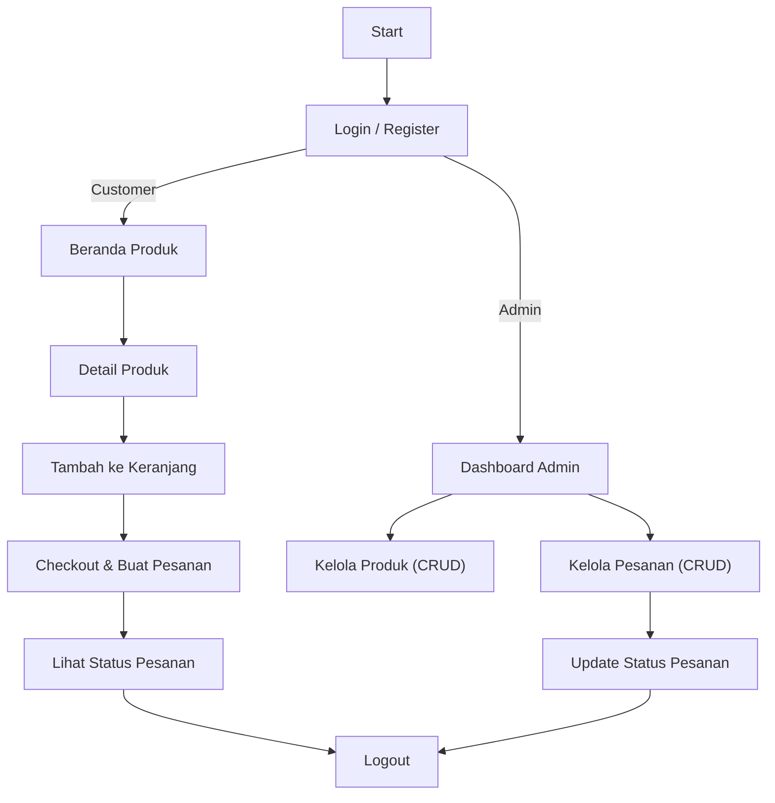
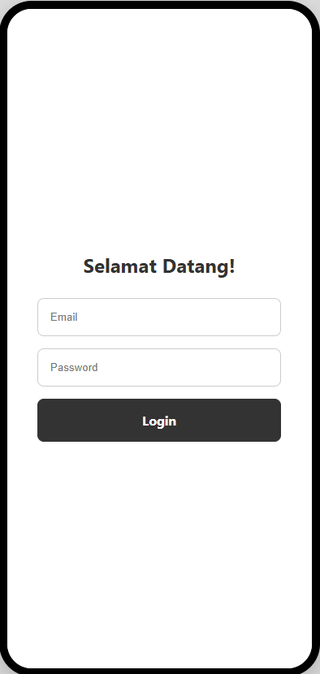
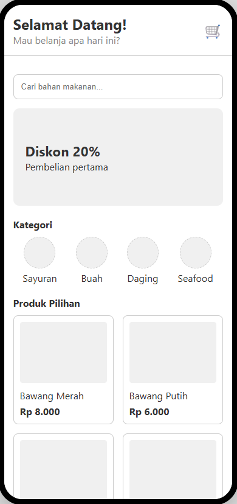
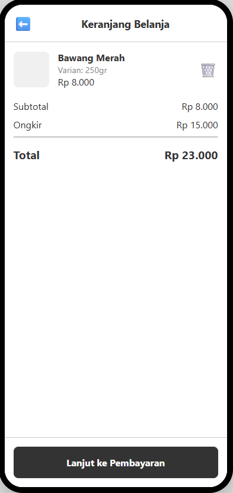
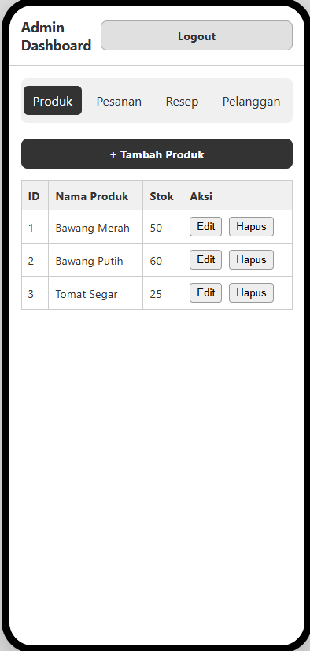
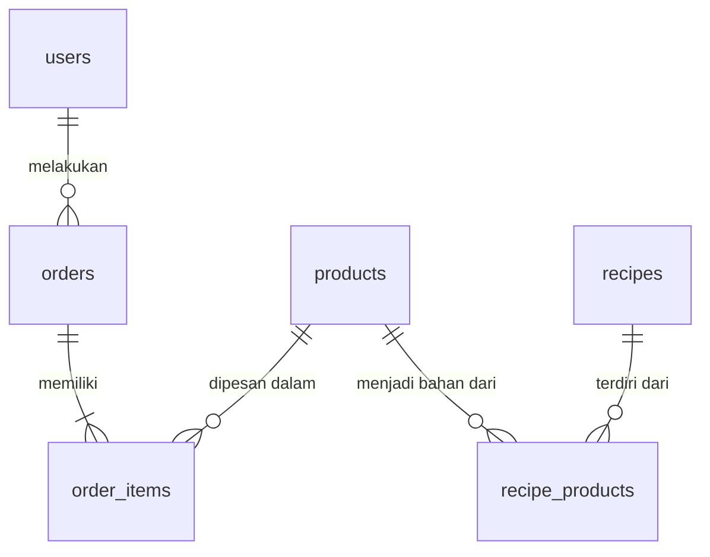

# Proposal & Desain — Aplikasi "BahanKu"

## 1. Deskripsi Aplikasi
BahanKu adalah aplikasi e-commerce berbasis React Native (Expo) yang menyediakan berbagai bahan baku makanan untuk masyarakat Indonesia.  
Aplikasi membantu pengguna menemukan, membeli, dan mengelola bahan masakan berdasarkan menu makanan — dari masakan Nusantara hingga internasional. Selain pembelian, tersedia juga daftar menu dan resep yang terkait langsung dengan produk di aplikasi.

Role utama:
- Superadmin (Penjual): mengelola produk, stok, pesanan, dan pelanggan.
- Customer (Pembeli): mendaftar akun, mencari produk, menambah ke keranjang, memesan, dan melihat status pesanan.

Integrasi:
- Supabase untuk autentikasi (email/password + Google), manajemen data (produk, pesanan, resep), dan storage gambar produk.

## 2. Target User
- Segmentasi: masyarakat umum Indonesia, khususnya pelanggan rumahan dan pecinta masak.
- Tujuan pengguna: mencari bahan makanan lengkap dan mudah diakses berdasarkan menu.
- Perangkat: smartphone Android / iOS.
- Autentikasi: pendaftaran manual atau login Google (Supabase).

## 3. Fitur-Fitur Utama
1. Autentikasi Pengguna
   - Registrasi & login via Supabase Auth (email/password, Google).
   - Sesi disimpan otomatis menggunakan AsyncStorage.
   - Validasi input dan pesan error di frontend.

2. Daftar Produk (Product Listing)
   - Tampilan grid/list produk.
   - Pencarian dan filter kategori (daging, sayur, bumbu, dsb).
   - Menampilkan gambar, nama, harga, stok, deskripsi singkat.

3. Detail Produk
   - Informasi lengkap (gambar, deskripsi, stok, harga).
   - Tombol "Tambah ke Keranjang".
   - Menampilkan bahan terkait resep bila ada.

4. Keranjang Belanja (Cart)
   - Tambah/hapus/ubah jumlah item.
   - Perhitungan total otomatis.
   - Tombol "Checkout" untuk membuat pesanan.

5. Manajemen Pesanan (Order Management)
   - Customer: melihat daftar pesanan & status ("Diproses", "Dikirim", "Selesai").
   - Admin: CRUD pesanan dan ubah status.
   - Update status real-time dari Supabase.

6. CRUD Produk untuk Superadmin
   - Tambah, edit, hapus produk.
   - Upload gambar ke Supabase Storage.
   - Validasi form (nama, harga, stok, deskripsi wajib).

7. Inspirasi Resep / Menu Makanan (Fitur Bonus)
   - Daftar resep dengan bahan yang terkait ke produk.
   - Favorit resep.

## 4. User Flow Diagram

## 5. Wireframe / Mockup (Low-Fidelity)
Deskripsi layar utama:

1. Login & Register
   - Tampilan hitam-putih sederhana.
   - Input: email, password, tombol "Masuk" & "Daftar".
   - Tombol "Login via Google".

2. Beranda Produk
   - Header logo + search bar.
   - Grid 2 kolom menampilkan gambar, nama, harga, stok.
   - Bottom Tab: Home, Cart, Orders, Profile.

3. Detail Produk
   - Gambar produk besar di atas.
   - Nama, deskripsi, harga, stok, tombol "Tambah ke Keranjang".
   - Bagian resep terkait di bawah (opsional).

4. Keranjang
   - List item (nama, jumlah, subtotal).
   - Tombol "Checkout" di bawah.
   - Konfirmasi pesanan via modal sederhana.

5. Halaman Admin Dashboard
   - Menu: Produk, Pesanan, Resep, Pelanggan.
   - Tabel hitam-putih sederhana.
   - Tombol CRUD (Tambah/Edit/Hapus).
   - Wireframe akan digambar di Figma / Draw.io.

## 6. Database Schema Design
Tabel utama: users, products, orders, order_items, recipes, recipe_products.

Tabel dan field (Supabase):

- users
  - id (uuid) — PK (Supabase Auth)
  - name (text)
  - email (text)
  - role (enum('admin','customer'))
  - created_at (timestamp)

- products
  - id (uuid) — PK
  - name (text)
  - description (text)
  - price (numeric)
  - stock (int)
  - category (text)
  - image_url (text)

- orders
  - id (uuid) — PK
  - user_id (uuid) — FK -> users
  - total_price (numeric)
  - status (enum('diproses','dikirim','selesai'))
  - created_at (timestamp)

- order_items
  - id (uuid) — PK
  - order_id (uuid) — FK -> orders
  - product_id (uuid) — FK -> products
  - quantity (int)
  - subtotal (numeric)

- recipes
  - id (uuid) — PK
  - title (text)
  - description (text)
  - image_url (text)
  - created_at (timestamp)

- recipe_products
  - id (uuid) — PK
  - recipe_id (uuid) — FK -> recipes
  - product_id (uuid) — FK -> products

ER Diagram (gambar)

## 7. Teknologi
- Frontend: React Native (Expo)
- Backend / DB / Auth / Storage: Supabase
- Desain Wireframe: Figma 
- Version Control: GitHub 
---